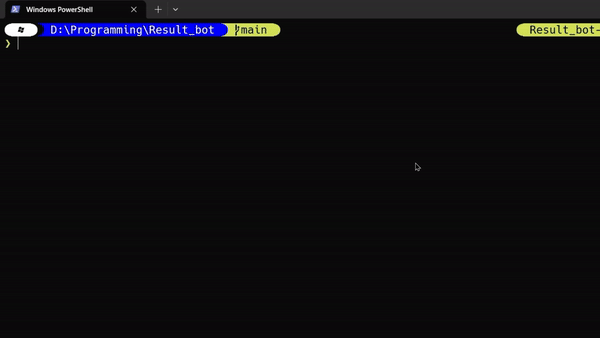

 # Anna University Results Fetcher

This script automates the process of retrieving exam results from the Anna University website. It handles the entire process, including navigating the website, filling in the required information, solving the CAPTCHA, and fetching the results.

## Features

- Automatic result retrieval using register number and date of birth
- CAPTCHA solving capability
- Easy-to-use 
- Fast and efficient result fetching

## Demo



## Prerequisites

Before you begin, ensure you have met the following requirements:
* Python 3.6 or higher installed on your system
* Required Python libraries (listed on the requirements.txt)

## Installation

1. Clone this repository:
   ```
   git clone https://github.com/MohdMarzook/Result_scrapping_bot.git
   ```
2. Navigate to the project directory:
   ```
   cd Result_scrapping_bot
   ```
3. Install the required dependencies:
   ```
   python setup.py
   ```

## Usage

1. Run the script:
   ```
   python Bot_to_scrape_result.py
   ```
2. Enter your register number when prompted
3. Enter your date of birth when prompted
4. The script will automatically fetch and display your results


## License

Distributed under the MIT License. See `LICENSE` for more information.

## Contact

@MohdMarzook
